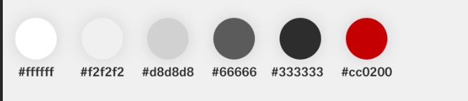

# Install dependencies

```
npm install
npm install --only=dev
```

# Setup Laravel Mix to your needs

### Normal behaviour:
- Images: Copy from `assets/src/images` to `assets/dist/images`
- Fonts: Copy from `assets/src/fonts` to `assets/dist/fonts`
- JS: Compile `assets/src/scripts/main.js`
- JS: Merge to single file `assets/src/pages/*.js`
- CSS: Compile Sass `assets/src/styles/main.sass`

### More Configuration
See `webpack.mix.js` file OR [https://laravel.com/docs/5.5/mix](https://laravel.com/docs/5.5/mix)


## How to Run Sass.
```
npm run watch
```

# Documentation

## Font-Family 

- CH Sans Light
```
$fontLight
```

- CH Sans Regular
```
$fontRegular
```
- CH Sans Bold
```
$fontBold
```


## Color Variable 




white = $white
```sass
$white: #ffffff
```
Lightengray = $lightenGray
```sass
$lightenGray: #f2f2f2
```
Middlegray = $middleGray
```sass
$middleGray: #d8d8d8
```
Darkgray = $darkGray
```sass
$darkGray: #666666
```
Black = $black
```sass
$black: #333333
```
Swissred = $swissRed
```sass
$swissRed: #cc0200
```

## Grid System

Gridsystem 

```html
<div class="container">
    <div class="row">
        <div class="col-s-12">
            {Your Content here}
        </div>
    </div>
</div>
```

