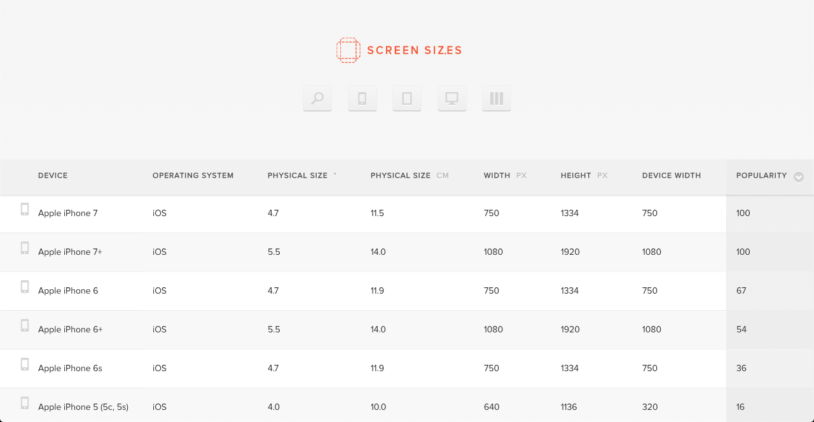
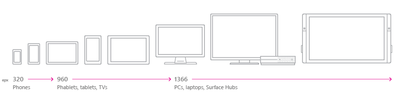
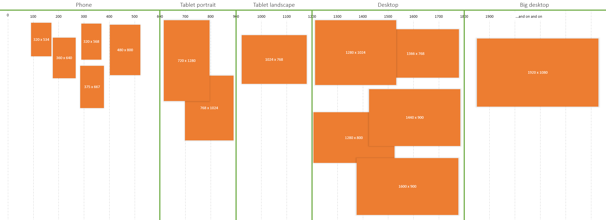
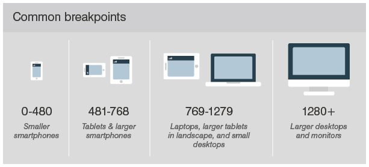
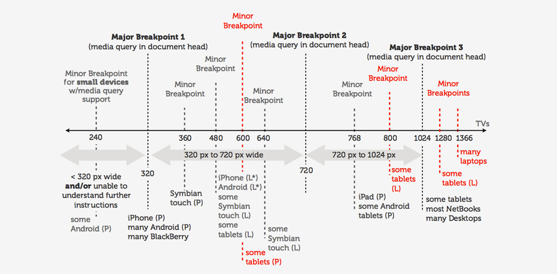

# Vorlesung 04.02.2019 Responsive Webdesign

## Vertiefte Auseinandersetzung 
- Bis nächste Woche 9.04 siehe Google Docs 

## RWD Grundprinzipen

- **Übersicht**
  - Geräte und Viewport 
  - Breakpoints
  - Mediaqueries
  - Einfache RWD Patterns

<hr>
## Geräte und Viewport 

[screensiz.es](http://screensiz.es/)



<hr>
## Geräte Parameter

> Nur displaygestütze Systeme !

- Auflösung
- Format: Hoch oder Quer
- Seitenverhältnis
- Eingabe: Touch / Mouse / Remote Control / ...
  
> opendevicelab.com <br>
> Seite zurzeit offline

- Versuch eine Annäherung: Geräte-Klassifikation
  

<hr>

## Viewport 

- Als **Viewport** wird der Bereich des Browserfensters bezeichnet, der für die Darstellung der Inhalte zur Verfügung steht
- Als **Standardbreite** für die Darstellung wurde ursprünglich eine **Device-Breite von 1024px** angenommen.
- Abzgl. Browser-Elemente blieben damit für den **Viewport 980px**
- Daher werden ohne weitere Angaben alle Inhalte entsprechen auf diese Darstellungsbreite optimiert dargestellt / skaliert.
- Sinnvoll: Anpassung an die Breite des Geräts
``` html
    <meta name="viewport" content="width=device-width, initial-scale= 1.0">
```
## Breakpoints

> Verschiedene Ansätze der Breakpoints 


  
  
  


**Strategie für Breakpoints**
- Sinnvolle Abstufung (Major-Breakpoints) setzen in Abhängigkeit zur Geräteklasse
- Weitere Feinabstufungen (Minor-Breakpoints) in Abhängigkeit zum Content festlegen
- Nicht zu viele Abstufungen
- Mobile first
- Viewport nicht vergessen!

<hr>

## Media Queries

- Width / Height des Viewports
- Width / Height des Devices
- Orientation (Landscape oder Portrait)
- Resolution (Auflösung)
- Aspect Ratio (Seitenverhältnis)

**Responsive CSS**
- Festlegung Viewport
- Mediaquery Sceen
- Mediaquery Print
- Alternative Einhindung
- Mobile first!

<hr>

## RWD Strategien
> Welche grundsätzliche Möglichkeiten zum Umgang mit Inhalt und UI gibt es ?

**RWD Strategien für Inhalte und UI**
- Smartphone - Reduzierung auf den Viewport und umgestalltung der Navigation
- Spalten anpassen
- Fließende Breakpoint verhalten - Besseren Platzumgang 
- Viewport fürs Lesen max. 80 Zeichen.
- Informationen ganz weglassen. 
- Bilder und Bildinformationen
- User Interface Eingabe
  - Hover Effect speziel abfangen.

## User Interface Patterns

[Google Design Patterns](https://developers.google.com/web/fundamentals/design-and-ux/responsive/patterns)

- Tiny Tweaks
  - Gingerwhale Patterns
  - Future Friendly
  
  - Kleine Anpassungen am Layout z.B. Font-Size, Bildgrößen, Umgang mit Inhalt

- Mostly FLuid
  - Fluid Grid bis zu einer bestimmten Bildschirmgröße Auf kleineren Geräten wird das Flussverhalten angepasst I.d:R. nur ein oder zwei Breakpoints

- Column Drop
  - Mehrspaltiges Layout bei voller Bildschirmbreite


- Layout Shifter 
  - Umfangreiche Layoutanpassung für unterschiedliche Bildschirmbreiten

- Off Canvas 
  - [Anaktae Off Canvas](https://www.anaktae.com/)
  - [iFly Magazine Off Canvas](https://www.iflymagazine.com/de)
  - Weniger häufig benötigter Inhalt im nicht sichtbaren Bereich, z.B. Navigation

