# Vorlesung 04.17.2019 Responsive Webdesign

## Typografie im Netz
**Responsive Schrift**

[Die Zeit](https://www.zeit.de/politik/deutschland/2019-04/abschiebung-asylbewerber-abschiebeanstalt-nrw-bueren-nicolas-rinoesl-geordnete-rueckkehr-gesetz-horst-seehofer)

- Die Zeit benützt im Fließtext eine Serifen Schrift.
- Wie viele Zeichen pro Zeile hat die Webseite?
- Rechtsbündigerflattersatz hat die Webseite
- Informationsbildung
- Bilder gearbeitet
- Kaum Farbe.
- Wenig Schriften und Schriftschnitten
- Gliederung mittels Inhaltsangaben rechts.
  

[Your Name Saves](http://yournamesaves.org/)

- Typografie erinnert an Mercedes Benz
- Radialer Verlaufe wie bei Mercedes 

[Terrapremiata](http://www.terrapremiata.it/)

- Überschrift in Versialien 
  - Schrift ist gleich lauter
- Hintergrund tauscht sich mit aus ohne das es bewusst wahrgenommen wird

[Margo Weathers](http://www.margoweathers.com/)

- Sehr dünner Schriftschnitt
- Display Schrift. 
- Die Videos bekommt den Fokus da die Schrift nicht als störend dargestellt wird.
  
[Intentionallies](http://www.intentionallies.co.jp/)
- "#" werden ausgeblendet
- Sehr unübersichtliche Landingpage 
- Unterpunkte sind sehr formal und klar gegliedert.

[Ridestore](https://www.ridestore.de/)

## Funktione von Typografie

- **Informationsvermittlung**
  - Lesbarkeit
  - Gleiderung und Strukturierung (Hierarchiebildung)

- **Kommunikations- und Gestaltungselement**
  - Unterstützung der emotionalen Wahrnehmung
  - Wiederkennung (Markenbildung)

## Leseverhalten im Netz

- 79 Prozent der Webnuter **lesen nicht ** - sie überfliegen und **scannen**
- 16 Prozent **lesen Wort für Wort**
- 20 Prozent **lesen nur** die **Headlines**
- **Online** wird **25% langsamer** gelesen

### Read, Skim und Scan

- **Read**: komplexe Texte Wort für Wort vollständig erfassen und verstehen
- **Skim**: Technik des Schnellesens zur Erfassung und Einordnung des Inhaltes in den Gesamtzusammenhang
- **Scan**: Nur bestimmte Schlüsselbegriffe werden auf ihr Vorkommen im Text geprüft

### F-Pattern (Desktop)

- Am Anfang nehmen wir den Text intensiver und gegen ende Scan ihn nur noch.

#### Lösungen

- Aussagekräftige Überschriften und Zwischenüberschriften
- Eine Idee pro Absatz
- Halbe Wortanzahl (oder weniger) im Vergleich zum normalen Schreiben
- Schlüsselwörter hervorheben
- Aufzählungen 
- Unterstützung durch bildhafte, visuell übersetzende Elemente 
  - z.B. Icons 

## Inverted Pyramid Style
 
 - das Wichtigste zuerst
 - Wichtige Details
 - Hintergrundinformationen

## Schriftarten
**Eine einfache Klassifikation**

siehe. Folien 

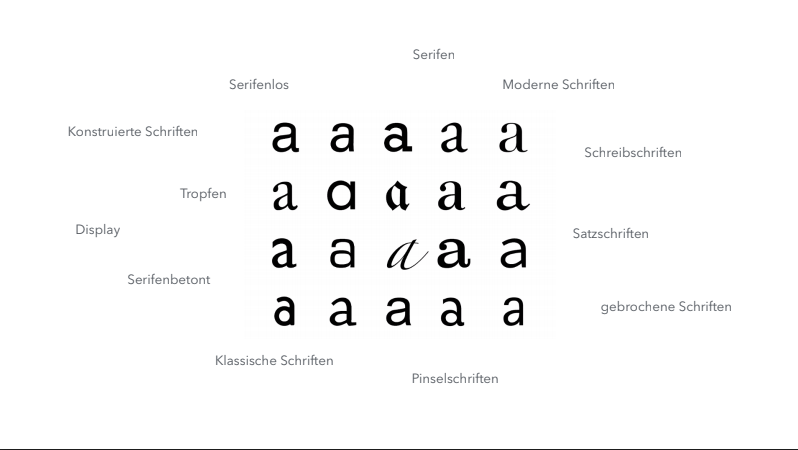 
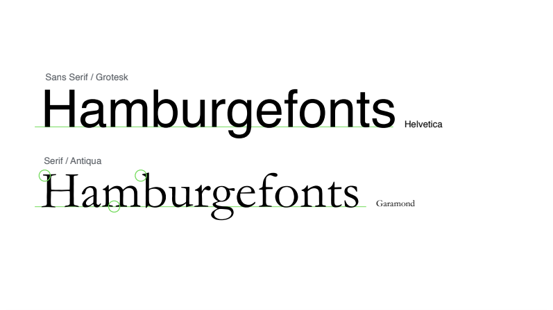 
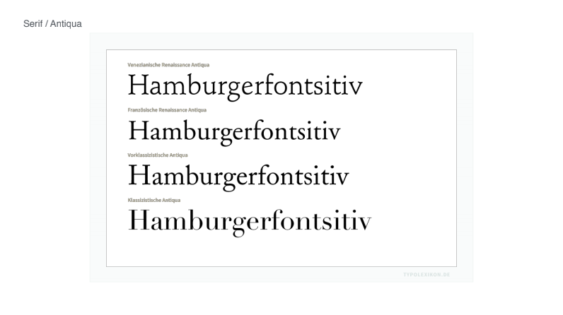 
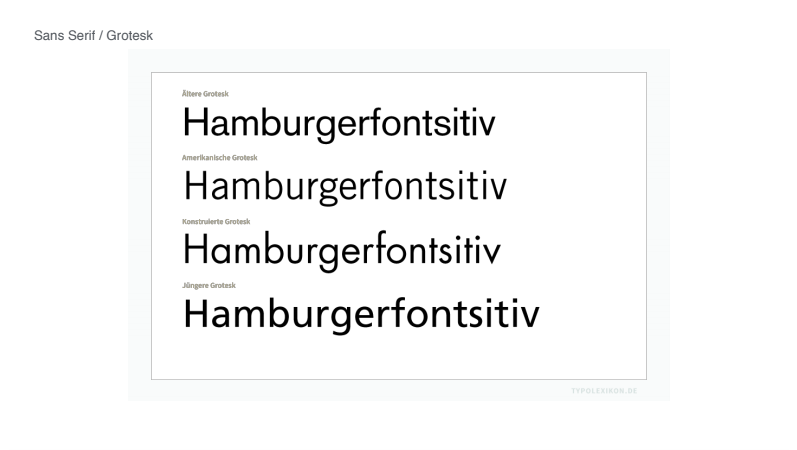 
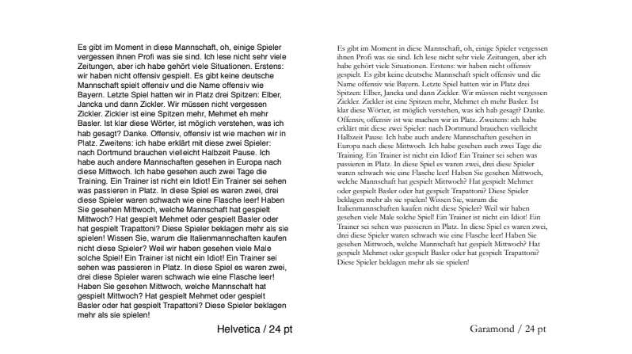 
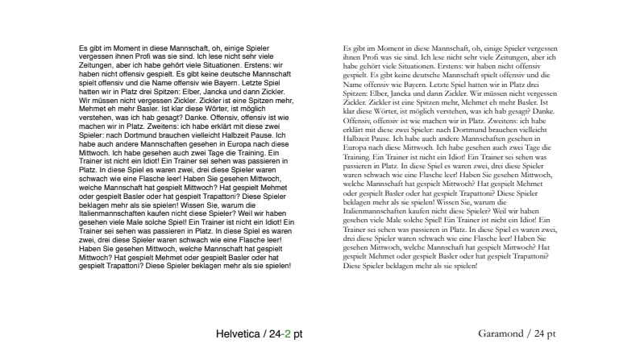 
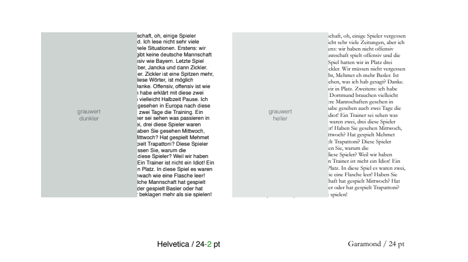 
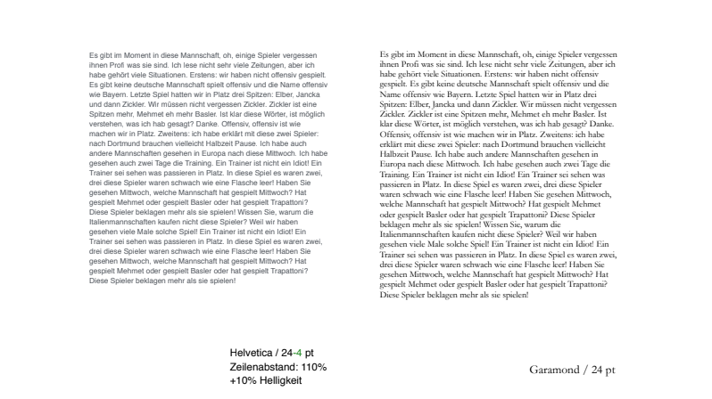 
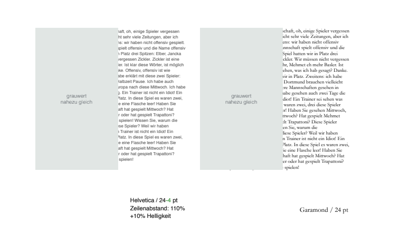 

## Schriftgrad

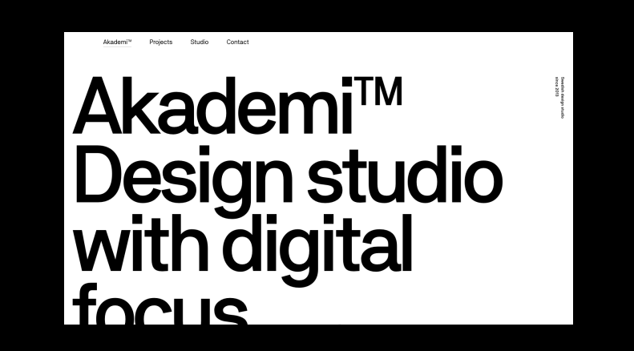 
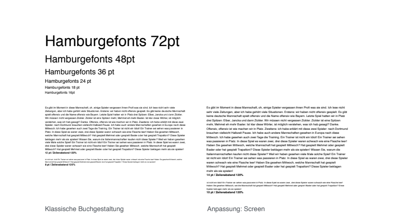 
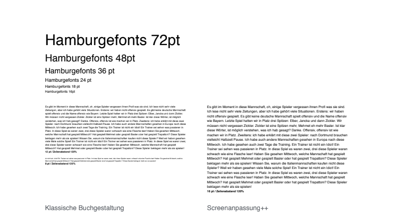 

## Schriftschnitte

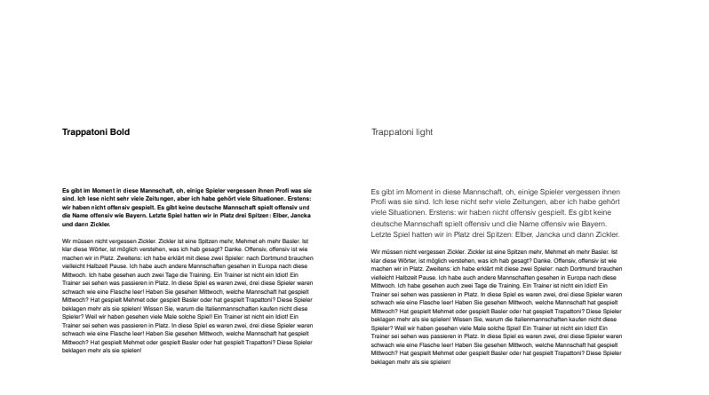 
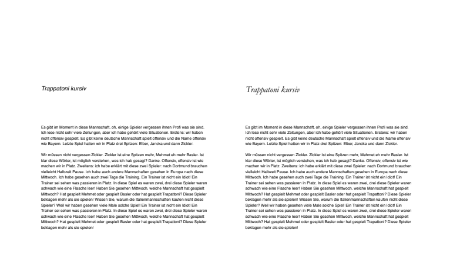 
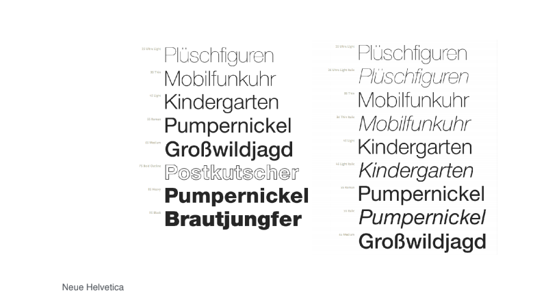 

## Lesbarkeit
**...hängt nicht vom Schriftgrad ab**

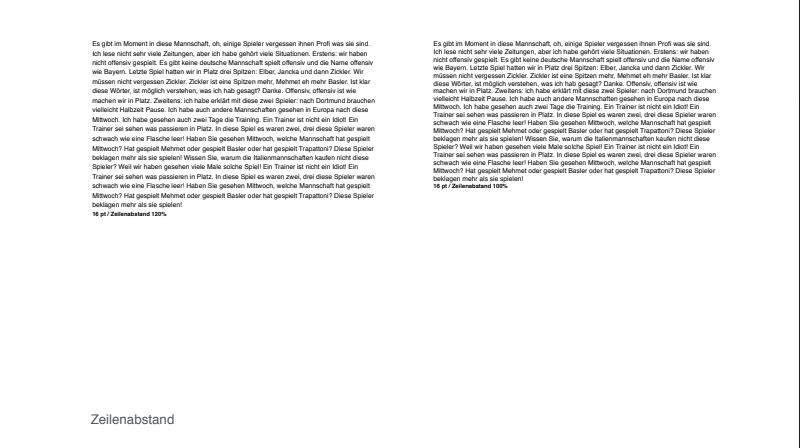 
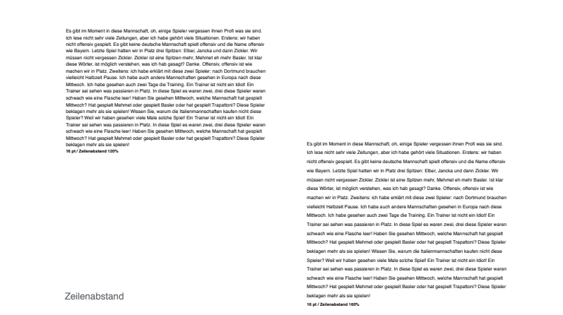 
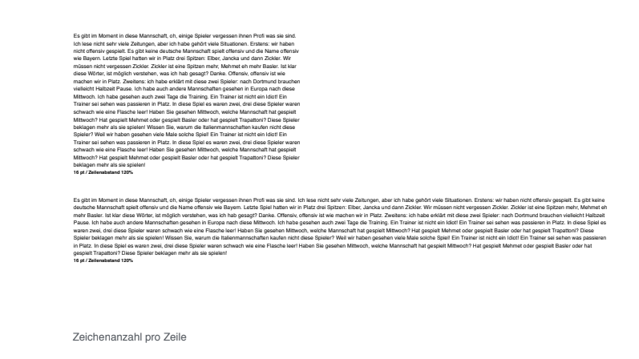 
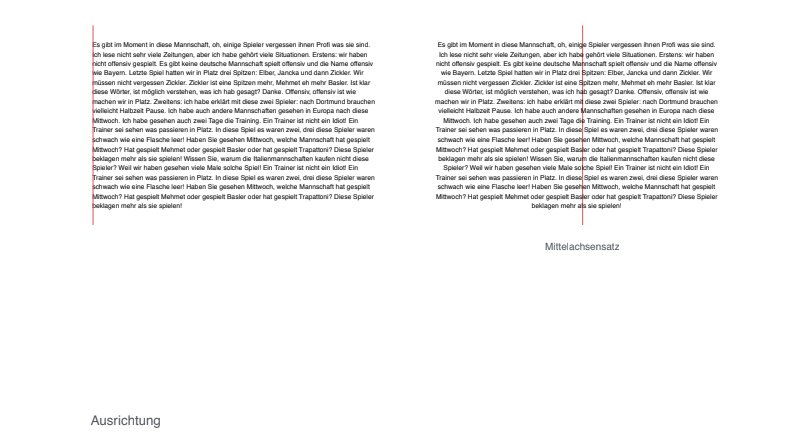 
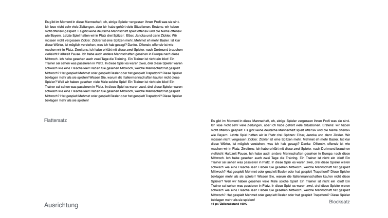 
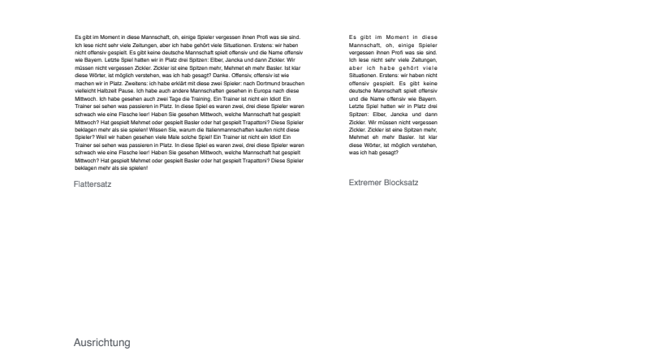 
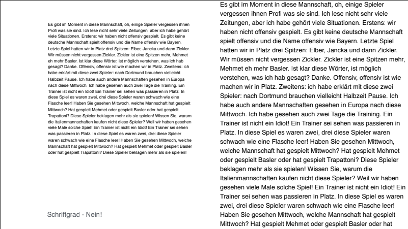 

## Übungsaufgabe